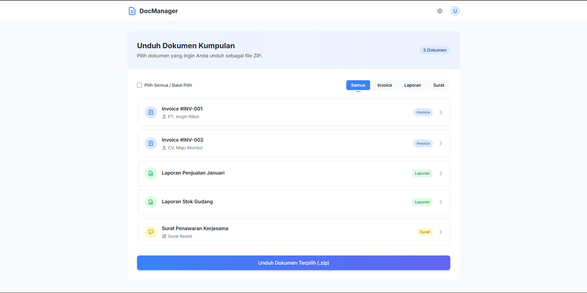

# Laravel Zip Document Exporter

Aplikasi web sederhana berbasis Laravel untuk mendemonstrasikan pembuatan beberapa file PDF secara dinamis dari data, lalu mengunduhnya sebagai satu file ZIP. Proyek ini sangat cocok sebagai dasar fitur pelaporan atau pembuatan dokumen massal dalam aplikasi yang lebih besar.



---

## 🚀 Fitur Utama

- **Pembuatan PDF Dinamis:** Mengonversi data (dari array/database) menjadi file PDF terstruktur.
- **Unduhan Massal (Bulk Download):** Mengemas banyak file PDF ke dalam satu arsip ZIP untuk mengatasi batasan browser.
- **Antarmuka Interaktif:** UI bersih dengan fungsionalitas JavaScript untuk seleksi dan filter tanpa reload halaman.
- **Arsitektur Laravel:** Kode terstruktur menggunakan pola Model-View-Controller (MVC).
- **Pembersihan Otomatis:** File sementara dihapus setelah proses unduhan selesai untuk menjaga kebersihan server.

---

## 🛠️ Teknologi yang Digunakan

- **Backend:** PHP 8.1+, Laravel 10.x
- **Frontend:** HTML, Tailwind CSS, JavaScript (Vanilla JS)

**Dependensi Utama:**
- `barryvdh/laravel-dompdf`: Wrapper Laravel untuk Dompdf.
- `ZipArchive`: Ekstensi PHP bawaan.

---

## ⚙️ Instalasi & Konfigurasi

Ikuti langkah-langkah berikut untuk menjalankan proyek ini di lingkungan lokal Anda:

1. **Clone repository:**
   ```bash
   git clone https://github.com/NAMA_USER_ANDA/laravel-zip-document-exporter.git
   ```

2. **Masuk ke direktori proyek:**
   ```bash
   cd laravel-zip-document-exporter
   ```

3. **Install dependensi Composer:**
   ```bash
   composer install
   ```

4. **Salin file environment:**
   ```bash
   cp .env.example .env
   ```

5. **Generate kunci aplikasi Laravel:**
   ```bash
   php artisan key:generate
   ```

6. **Jalankan server pengembangan:**
   ```bash
   php artisan serve
   ```

Aplikasi akan berjalan di [http://127.0.0.1:8000](http://127.0.0.1:8000).

---

## 🕹️ Cara Penggunaan

1. Buka browser dan kunjungi: [http://127.0.0.1:8000](http://127.0.0.1:8000)  
   (Halaman utama akan langsung menampilkan daftar dokumen.)

2. Pilih satu atau beberapa dokumen menggunakan checkbox.  
   Anda juga dapat menggunakan fitur "Pilih Semua" atau filter berdasarkan tipe dokumen.

3. Klik tombol **"Unduh Dokumen Terpilih (.zip)"**.

4. File ZIP berisi semua PDF yang Anda pilih akan terunduh secara otomatis.

---

## 🤝 Kontribusi

Kontribusi sangat terbuka! Jika Anda memiliki ide perbaikan atau menemukan bug, silakan buat issue atau kirimkan pull request.

---

## 📜 Lisensi

Proyek ini dilisensikan di bawah [MIT License](LICENSE).